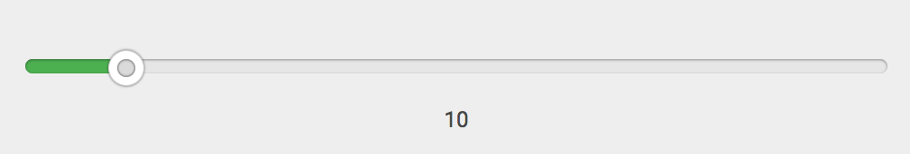

# React Rangeslider
[![NPM Package][npm_img]][npm_site] [![Travis Status][trav_img]][trav_site] [![Standard Code Style][std_img]][std_site]
> A fast & lightweight responsive react slider component.



Check out [docs & examples](https://whoisandie.github.io/react-rangeslider).

## Installation
Using `npm` (use `--save` to include it in your package.json)

```bash
$ npm install react-rangeslider --save
```

Using `yarn` (use `--dev` to include it in your package.json)

```bash
$ yarn add react-rangeslider --dev
```


## Usage
React-Rangeslider is bundled with a single slider component. By default, basic styles are applied, but can be overridden depending on your design requirements.

With a module bundler like webpack that supports either CommonJS or ES2015 modules, use as you would anything else:

```js
// Using an ES6 transpiler like Babel
import Slider from 'react-rangeslider'

// To include the default styles
import 'react-rangeslider/lib/index.css'

// Not using an ES6 transpiler
var Slider = require('react-rangeslider')
```

The UMD build is also available on [unpkg][unpkg]:

```js
<script src="https://unpkg.com/react-rangeslider/umd/ReactRangeslider.min.js"></script>
```

You can find the library on `window.ReactRangeslider`. Optionally you can drop in the default styles by adding the stylesheet.
```css
<link rel="stylesheet" href="https://unpkg.com/react-rangeslider/umd/ReactRangeslider.css" />
```

## Example

```js
import React, { Component } from 'react'
import Slider from 'react-rangeslider'

class VolumeSlider extends Component {
  constructor(props, context) {
    super(props, context)
    this.state = {
      volume: 0
    }
  }

  handleOnChange = (value) => {
    this.setState({
      volume: value
    })
  }

  render() {
    let { volume } = this.state
    return (
      <Slider
        value={volume}
        orientation="vertical"
        onChange={this.handleOnChange}
      />
    )
  }
}
```


## API
Rangeslider is bundled as a single component, that accepts data and callbacks only as `props`.

### Component
```js
import Slider from 'react-rangeslider'

// inside render
<Slider
  min={Number}
  max={Number}
  step={Number}
  value={Number}
  orientation={String}
  reverse={Boolean}
  tooltip={Boolean}
  labels={Object}
  format={Function}
  onChange={Function}
  onChangeComplete={Function}
/>
```

### Props
Prop   	 			 |  Type      |  Default      |  Description
---------   	 |  -------   |  -------      |  -----------
`min`     		 |  number    |  0				   	|  minimum value the slider can hold
`max`    			 |  number    |  100				  |  maximum value the slider can hold
`step` 				 |  number    |  1          	|  step in which increments/decrements have to be made
`value`        |  number    |               |  current value of the slider
`orientation`  |  string    |  horizontal   |  orientation of the slider
`tooltip`      |  boolean   |  true         |  show or hide tooltip
`reverse`  		 |  boolean   |  false			  |  reverse direction of vertical slider (top-bottom)
`labels`       |  object    |  {}           |  object containing key-value pairs. `{ 0: 'Low', 50: 'Medium', 100: 'High'}`
`format`     |  function  |               |  function to format and display the value in label or tooltip
`onChange`  	 |  function  |               |  function gets called whenever the slider handle is being dragged or clicked
`onChangeComplete`     |  function  |               |  function gets called whenever the user stops dragging the slider handle.


## Development
To work on the project locally, you need to pull its dependencies and run `npm start`.

```bash
$ npm install
$ npm start
```

## Issues
Feel free to contribute. Submit a Pull Request or open an issue for further discussion.

## License
Licensed under MIT License. Copyright © 2015 whoisandie

See [LICENSE](./LICENSE) for more information.


[npm_img]: https://img.shields.io/npm/v/react-rangeslider.svg?style=flat-square
[npm_site]: https://www.npmjs.org/package/react-rangeslider
[trav_img]: https://api.travis-ci.org/whoisandie/react-rangeslider.svg
[trav_site]: https://travis-ci.org/whoisandie/react-rangeslider
[std_img]: https://img.shields.io/badge/code%20style-standard-brightgreen.svg
[std_site]: http://standardjs.com
[unpkg]: https://unpkg.com/react-rangeslider/umd/ReactRangeslider.min.js
